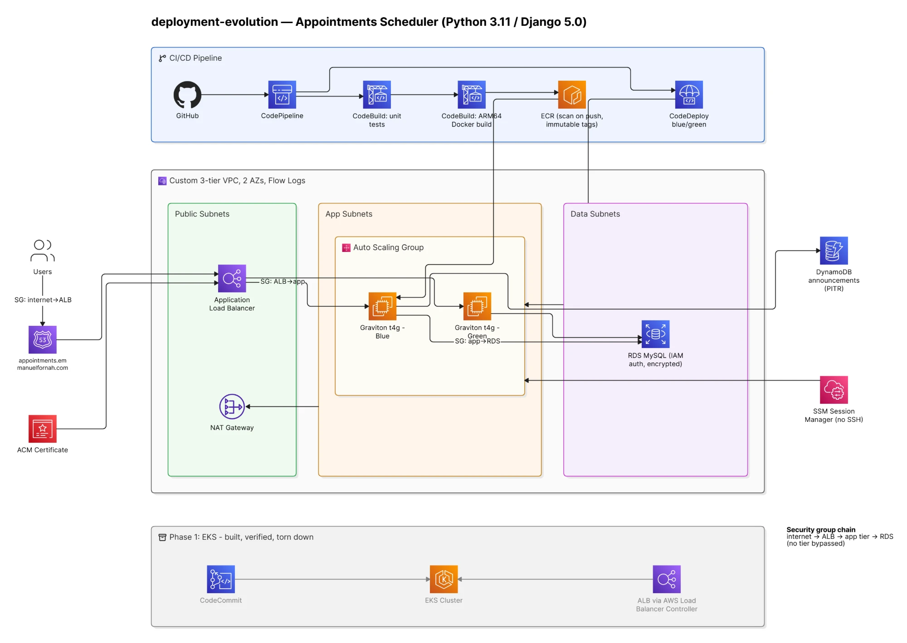
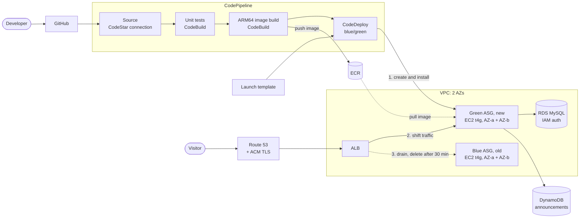

# Architecture

How the Appointments Scheduler (Python 3.11 / Django 5.0) runs on AWS
today, and how a change gets from GitHub to production. Everything here
is provisioned by the Terraform in [`infra/`](infra/).

## Infrastructure

### Request path

1. **DNS and TLS.** A visitor opens `appointments.emmanuelfornah.com`.
   A Route 53 alias record points at the Application Load Balancer,
   which terminates HTTPS with an ACM-issued certificate and redirects
   HTTP to HTTPS.
2. **Load balancer (public subnets).** The internet-facing ALB sits in
   the public subnets of a custom VPC spanning 2 Availability Zones and
   forwards to a health-checked target group.
3. **App tier (app subnets).** Graviton `t4g.small` EC2 instances in an
   Auto Scaling Group, one per AZ, run the Django container pulled from
   ECR. They have no public IPs.
4. **Data tier (data subnets).** Bookings live in **Amazon RDS MySQL
   8.0**, encrypted at rest, with **IAM database authentication**, so no
   database password exists in app code or config. Salon announcements
   come from **Amazon DynamoDB** (on-demand, point-in-time recovery).

### Network and security

- **3-tier VPC:** public, app and data subnets in each of 2 AZs.
- **Security group chain:** internet → ALB → app tier → RDS. Each tier
  accepts traffic only from the tier in front of it, so no tier can be
  bypassed.
- **Outbound:** the app tier reaches the internet through a NAT gateway
  in the public subnets. AWS services are reached privately through VPC
  endpoints: interface endpoints for ECR (API and Docker), CloudWatch
  Logs, Secrets Manager, SSM, SSM Messages and EC2 Messages, plus an S3
  gateway endpoint.
- **No SSH:** admin access is through **SSM Session Manager** only, and
  IMDSv2 is enforced on every instance.
- **Audit:** VPC Flow Logs capture all traffic (30-day retention).

## Deployment pipeline

A push to GitHub starts **AWS CodePipeline** through a CodeStar
connection. It has four stages:

| Stage | Service | What it does |
|---|---|---|
| Source | CodeStar connection | Pulls the commit from GitHub |
| UnitTest | CodeBuild | Runs the Django test suite |
| BuildImage | CodeBuild | Builds the ARM64 Docker image and pushes it to **ECR** (scan on push, immutable tags) |
| Deploy | CodeDeploy | Blue/green rollout to EC2 |

### Blue/green rollout

1. **Create and install.** CodeDeploy copies the live Auto Scaling
   Group into a new **green** group, built from the Terraform-managed
   launch template, and installs the new release on it.
2. **Shift traffic.** Once green passes its health checks, the ALB
   sends all production traffic to it.
3. **Drain and delete.** The old **blue** group is drained and kept for
   30 minutes before it is deleted. During that window, rolling back
   only means sending traffic back to blue.

Because CodeDeploy replaces the Auto Scaling Group on every deploy,
Terraform owns the launch template while CodeDeploy owns the live group.

### Simplified view

## Phase 1: EKS (built, verified, torn down)

Before this design, the same app ran on Amazon EKS: CodeCommit →
CodePipeline → CodeBuild → `kubectl apply`, with an ALB in front through
the AWS Load Balancer Controller. It was torn down after verification;
the [README](README.md) covers
why, and [`screenshots/architecture/cicd-pipeline-eks-architecture.png`](screenshots/architecture/cicd-pipeline-eks-architecture.png)
shows that architecture.
