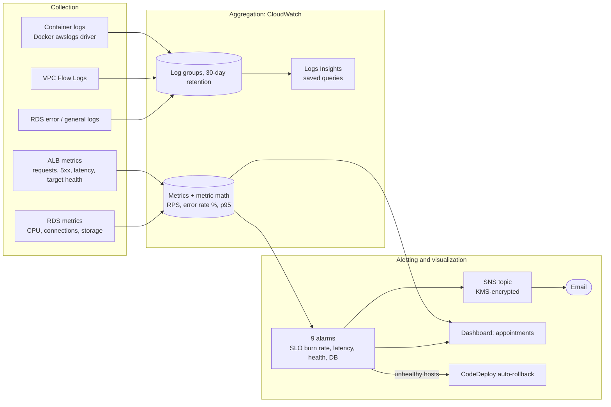

# Monitoring and Optimization Plan

How the Appointments Scheduler is observed, what its reliability
targets are, what it costs, and where that cost can come down. All of
the monitoring below is Terraform in [`infra/monitoring.tf`](infra/monitoring.tf),
applied against the same remote state as the rest of the stack; nothing
is created by hand in the console.

## 1. Monitoring architecture



**Design rule:** every alarm watches the ALB target group or the RDS
instance, never the Auto Scaling Group. CodeDeploy replaces the ASG on
every blue/green deploy, so an alarm keyed on an ASG name would silently
stop working after the first release. The target group and the database
are the two identities that survive every deploy.

## 2. Metrics, logs and traces

### Metrics

| Signal | Source | Statistic | Why |
|---|---|---|---|
| Requests per second | ALB `RequestCount` | Sum ÷ period | Traffic baseline; denominator for error rate |
| Error rate % | ALB `HTTPCode_ELB_5XX_Count` + `HTTPCode_Target_5XX_Count` ÷ `RequestCount` | Sum | Availability SLI |
| Latency p95 / p50 | ALB `TargetResponseTime` | p95, p50 | Latency SLI; p50 shows whether slowness is everyone or a tail |
| Healthy / unhealthy targets | ALB `HealthyHostCount`, `UnHealthyHostCount` | Min / Max | "Is the site up", deploy health |
| Database CPU | RDS `CPUUtilization` | Average | Capacity of the single `db.t4g.micro` |
| Database connections | RDS `DatabaseConnections` | Max | Connection leaks, gunicorn worker count |
| Database free storage | RDS `FreeStorageSpace` | Min | 20 GB allocated; MySQL stops writing when full |

Measured at the load balancer on purpose: it sees exactly what a
visitor sees, including requests that never reach Django.

### Logs

| Log group | Contents | Retention |
|---|---|---|
| `/appointments/app` | Django/gunicorn container output (`--log-driver awslogs`) | 30 days |
| `/vpc/appointments-flow-logs` | All accepted and rejected VPC traffic | 30 days |
| `/appointments/codebuild/*` | Unit test and image build output | 30 days |
| `/aws/rds/instance/scheduler-db/*` | MySQL error and general logs | RDS default |

Saved Logs Insights queries (first places to look when an alarm fires):
`appointments/app-errors` (errors, exceptions, tracebacks in the app log)
and `appointments/vpc-rejected-traffic` (top rejected sources and ports).

### Traces

Not collected yet. With one service and one database, the ALB latency
split (p50 vs p95) plus the app log answers most "where is the time
going" questions. The next step, when a second service or an external
API call appears, is AWS X-Ray through the OpenTelemetry Django
instrumentation (ADOT), sampling 5% of requests.

## 3. SLIs and SLOs

| SLI | Measured as | SLO | Error budget (30 days) |
|---|---|---|---|
| **Availability** | Non-5xx requests ÷ all requests at the ALB | **99.9%** | 0.1% of requests (~43 min of full outage) |
| **Latency** | p95 `TargetResponseTime` | **< 500 ms** | Alarm when p95 exceeds it for 3 of 5 minutes |

**Why 99.9%, not 99.99%:** the compute tier is multi-AZ, but RDS is
single-AZ by design (it halves the database cost; see the README's cost
posture). An RDS maintenance window or an AZ problem can take minutes,
which 99.9% absorbs and 99.99% (4 minutes a month) does not. The SLO
promises what the architecture can actually deliver.

**Why 500 ms, not 300 ms:** every booking page is server-rendered by
Django and does an RDS query plus a DynamoDB scan for announcements. 500
ms is a defensible starting target for that path. The plan is to read
two weeks of real p95 from the dashboard, then tighten toward 300 ms if
the baseline sits well under it. Both targets are Terraform variables
(`slo_availability_target`, `slo_latency_p95_seconds`).

## 4. Alerts

Every alarm emails the KMS-encrypted SNS topic `appointments-alerts`
when it fires and again when it recovers.

| Alarm | Condition | Severity | First response |
|---|---|---|---|
| `slo-error-budget-fast-burn` | 1h error rate > 1.44% (14.4x budget burn, min 20 requests) | Page | Check the latest deploy; roll back in CodeDeploy if it lines up |
| `slo-error-budget-slow-burn` | 6h error rate > 0.6% (6x budget burn, min 100 requests) | Same day | Run `app-errors` query; look for a recurring exception |
| `slo-latency-p95` | p95 > 500 ms for 3 of 5 min | Same day | Dashboard: p50 vs p95, RDS CPU and connections |
| `no-healthy-hosts` | 0 healthy targets for 2 min | Page | Site is down; check target health and the latest deploy |
| `unhealthy-hosts` | Any unhealthy target for 2 min | Info | Also triggers CodeDeploy auto-rollback during a deploy |
| `alb-5xx` | > 5 ALB-generated 5xx in 5 min | Same day | Usually no healthy target or a timeout |
| `app-5xx` | > 5 Django 5xx in 5 min | Same day | Run `app-errors` query |
| `rds-cpu-high` | RDS CPU > 80% for 10 min | Same day | Slow or N+1 queries; see section 6 |
| `rds-storage-low` | < 2 GB free | Same day | Increase `allocated_storage` in `rds.tf` |

**Why burn-rate alerts:** a plain "error rate > 0.1%" alarm fires on a
single failed request at low traffic and says nothing about urgency. The
two burn-rate windows (Google SRE workbook) alert while the SLO is *at
risk*: the fast one when 2% of the month's budget is gone in an hour,
the slow one when 5% is gone in six. The minimum-request guard stops one
stray 500 at 3 a.m. from paging anyone.

**Procedure:** confirm the email subscription after apply (AWS sends a
link). On a page: open the dashboard, check whether a deploy just
happened (CodeDeploy history), roll back if so, otherwise work through
the saved queries.

## 5. Dashboards by audience

One CloudWatch dashboard, `appointments`, read top-down:

| Row | Audience | Widgets |
|---|---|---|
| Status | Everyone (owner, reviewer, on-call) | SLO targets as text; live state of all 9 alarms |
| Golden signals | On-call | Requests/sec; latency p95/p50 with the SLO line; error rate % with the error-budget line |
| Capacity | On-call | Target health; RDS CPU, connections, free storage |

Two further views are designed but not built, because the data for them
lives elsewhere:

- **Salon owner (business):** bookings per day and busiest hours. Needs
  a custom metric or a log-based metric on successful bookings.
- **Cost owner (FinOps):** Cost Explorer grouped by the `Project` and
  `Environment` tags, plus an AWS Budget alert at the monthly target.

## 6. Performance analysis and optimization

**Method:** RED for the service (Rate, Errors, Duration from the golden
signals row), USE for the database (Utilization, Saturation, Errors from
RDS CPU, connections and the error log). Establish a two-week baseline,
change one thing at a time, compare p95 and RDS CPU before and after. A
short load test from CloudShell (for example `hey -z 2m -c 10`) gives a
repeatable before/after number.

**Recommendations, from the code:**

1. **Filter appointments by date in SQL.** `views.py` loads every
   appointment for a hairdresser, then filters to the chosen day in
   Python (its own comment says so). As bookings accumulate, this grows
   without limit. A `start_datetime__date=` filter makes it one indexed
   query.
2. **Cache announcements.** Every page load runs a DynamoDB `Scan` of
   the announcements table. A 60-second Django cache removes almost all
   of those reads and their latency.
3. **Turn on the MySQL slow query log.** The RDS log export is
   configured, but the default parameter group leaves `slow_query_log`
   off, so nothing is captured. A custom parameter group with
   `long_query_time = 0.5` would show which queries break the latency
   SLO.

## 7. Cost analysis

**Billed today:** the Cost Explorer screenshot in
[`screenshots/ec2-live/`](screenshots/ec2-live/08_cost_explorer_actual_spend.png)
shows only the domain registrar, because Free Tier and credits cover
the rest at this scale and account age.

**What it costs at list price** (us-east-2, 730 hours a month; estimates
to confirm in the AWS Pricing Calculator):

| Component | Basis | Est. $/month |
|---|---|---|
| VPC interface endpoints | 7 endpoints × 2 AZs × $0.01/h | **102.20** |
| NAT gateway | $0.045/h + minimal data | 32.85 |
| EC2 | 2 × t4g.small × $0.0168/h | 24.53 |
| Application Load Balancer | $0.0225/h + ~1 LCU | 22.27 |
| RDS | db.t4g.micro single-AZ + 20 GB gp3 | 13.98 |
| Public IPv4 addresses | ALB (2) + NAT (1) × $0.005/h | 10.95 |
| EC2 detailed monitoring | 2 instances × ~7 metrics × $0.30 | 4.20 |
| EBS | 2 × 20 GB gp3 | 3.20 |
| CloudWatch | 9 alarms (2 use 3 metrics), logs, flow logs | ~4.00 |
| KMS, Secrets Manager, Route 53 zone | 2 keys, 2 secrets, 1 zone | ~3.30 |
| CodePipeline, CodeBuild, ECR, Config, DynamoDB | Low usage | ~4.00 |
| **Total** | | **~$225** |

The single biggest line is the private connections to AWS services,
not compute.

**Tagging for cost allocation:** every Terraform resource carries
`Project=appointments`, `Environment=production`, `Owner` and
`ManagedBy=terraform` through the provider's `default_tags`. The
instances and EBS volumes launched from the template get the same tags
explicitly, because `default_tags` doesn't reach resources an ASG
launches. One console step remains: activate `Project`, `Environment`
and `Owner` as cost allocation tags in Billing, after which Cost
Explorer can group spend by them (from the activation date forward).

## 8. Cost optimization

| # | Action | Est. saving / month | Tradeoff |
|---|---|---|---|
| 1 | **Remove the 7 interface endpoints**; AWS API traffic goes through the existing NAT gateway. Keep the free S3 gateway endpoint. | **~$100** (endpoints minus a few cents of NAT data) | AWS calls leave the VPC through NAT (still TLS, still IAM-scoped). Alternative: keep them in one AZ only for ~$51. |
| 2 | **Turn off EC2 detailed monitoring** in the launch template. | $4.20 | 5-minute EC2 metrics instead of 1-minute. Nothing depends on them: every alarm reads ALB or RDS metrics. |
| 3 | **1-year Compute Savings Plan** for the 2 always-on instances. | ~$7 (~30% of EC2) | A one-year commitment to that spend. |
| 4 | **Replace the NAT gateway with a NAT instance** (t4g.nano). | ~$29 | One more instance to patch; worth it only after #1. |

Considered and rejected: **scaling to one instance at night** (the
lab's "minimum instances" lever). It would save ~$6 but break the
two-AZ guarantee the availability SLO depends on. Already in place:
ECR lifecycle policy (untagged images expire after 14 days), 30-day log
retention, gp3 volumes, Graviton instances, single-AZ RDS.

Actions 1 and 2 together cut the list-price bill by about **45%**
(~$225 to ~$120) with no change to the SLOs.

## Appendix: evidence and exports

| Evidence | Where |
|---|---|
| Deployment | [`screenshots/ec2-live/`](screenshots/ec2-live/): live app, CodeDeploy blue/green traffic shift, deploy history |
| Dashboard | Screenshot of CloudWatch → Dashboards → `appointments` after apply |
| Alert configuration | Screenshot of CloudWatch → Alarms filtered to `appointments-` |
| Tagging and cost | Tag Editor filtered to `Project=appointments`; Cost Explorer grouped by tag |
| Configuration | [`infra/monitoring.tf`](infra/monitoring.tf), [`infra/versions.tf`](infra/versions.tf) (tags), [`infra/variables.tf`](infra/variables.tf) (SLO targets) |

Dashboard JSON export, from CloudShell after apply:

```bash
aws cloudwatch get-dashboard --dashboard-name appointments \
  --query DashboardBody --output text | python3 -m json.tool > dashboard.json
```
